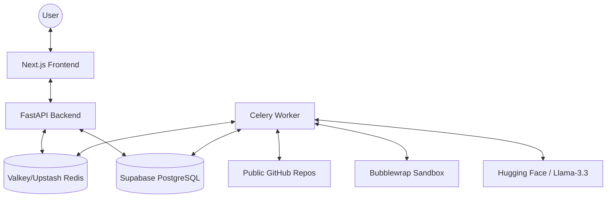

# System Architecture

RepoAudit is an automated reproducibility analysis tool designed to audit machine learning research repositories. It uses a distributed architecture to handle intensive static analysis and dynamic execution tasks.

## High-Level Architecture

## Core Components

### 1. Frontend (Next.js 15)
- **Role**: Provides the user interface for submitting repositories and viewing audit results.
- **Key Features**: 
  - Real-time status polling for ongoing audits.
  - Interactive visualizations (Radar charts, score history).
  - Responsive design using Tailwind CSS.

### 2. Backend API (FastAPI)
- **Role**: Entry point for all requests, managing audit lifecycle and result retrieval.
- **Key Features**:
  - Asynchronous task submission via Celery.
  - Efficient caching layer using Redis for instant result retrieval of known commit hashes.
  - Robust URL resolution for research paper links (arXiv, Papers With Code).

### 3. Worker (Celery)
- **Role**: Performs the actual audit analysis.
- **Key Features**:
  - Clones repositories lazily (shallow clone).
  - Orchestrates a suite of specialized auditors.
  - Executes dynamic reproduction checks in a secure sandbox.

### 4. Storage & State
- **Redis (Valkey/Upstash)**: Used as the message broker for Celery and as a fast L1 cache for recent audit results.
- **PostgreSQL (Supabase)**: Persistent storage for repository metadata and historical audit reports.

## Audit Engine Deep Dive

The audit engine utilizes a pipeline of specialized auditors, each focusing on a specific aspect of reproducibility:

| Auditor | Purpose | Technique |
|---------|---------|-----------|
| **AST Auditor** | Detects non-deterministic patterns in code (e.g., missing seeds). | Static analysis via `ast` and `libcst`. |
| **Dependency Auditor** | Analyzes environment requirements and dependency pinning. | Parsing `requirements.txt`, `pyproject.toml`, etc. |
| **Path Auditor** | Finds hardcoded absolute paths that break portability. | Pattern matching and AST analysis. |
| **Semantic Auditor** | Verifies alignment between README documentation and project structure. | LLM-powered semantic analysis. |
| **Replay Auditor** | Performs dynamic execution checks (L0–L3 verification). | Orchestrates Bubblewrap for secure execution. |
| **Decay Auditor** | Tracks "bit rot" via dependency stale-dating and yanked packages. | PyPI API snapshots & dependency age analysis. |
| **Auto-Remediator** | Generates patches for high-confidence reproducibility issues. | Deterministic code-mods via `libcst`. |

## Security & Isolation

For dynamic execution (the Replay Auditor), RepoAudit uses **Bubblewrap** to create an unprivileged sandbox. This ensures that:
- The execution is isolated from the host filesystem (except for the cloned repo).
- Network access can be restricted or monitored.
- Resource limits can be enforced, preventing malicious or runaway reproduction scripts from impacting system stability.

---

[← Back to Main README](../readme.md)
