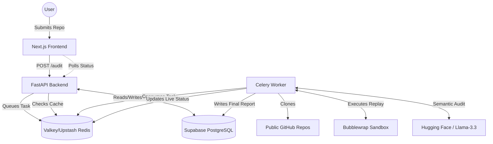

# System Architecture

RepoAudit is an automated reproducibility analysis tool designed to audit machine learning research repositories. It uses a distributed architecture to handle intensive static analysis and dynamic execution tasks.

## High-Level Architecture

```mermaid
graph TD
    User((User))
    Frontend[Next.js Frontend]
    API[FastAPI Backend]
    Worker[Celery Worker]
    Redis[(Valkey/Upstash Redis)]
    DB[(Supabase PostgreSQL)]
    LLM[Hugging Face / Llama-3.3]
    Sandbox[Bubblewrap Sandbox]
    Git[Public GitHub Repos]

    User -->|Submits Repo| Frontend
    Frontend -->|POST /audit| API
    Frontend -.->|Polls Status| API
    API -->|Queues Task| Redis
    API -->|Checks Cache| Redis
    API <-->|Reads/Writes Metadata| DB
    Worker -->|Consumes Task| Redis
    Worker -->|Updates Live Status| Redis
    Worker -->|Writes Final Report| DB
    Worker -->|Clones| Git
    Worker <-->|Executes Replay| Sandbox
    Worker <-->|Semantic Audit| LLM
```

## Core Components

### 1. Frontend (Next.js 15)
- **Role**: Provides the user interface for submitting repositories and viewing audit results.
- **Key Features**: 
  - **Real-Time Progress UI**: Reads live audit statuses by actively polling the FastAPI backend to present an interactive progress stepper, ensuring users stay engaged during long audits.
  - Interactive visualizations (Radar charts, score history, **Pipeline DAG**).
  - Responsive design using Tailwind CSS.

### 2. Backend API (FastAPI)
- **Role**: Entry point for all requests, managing audit lifecycle and result retrieval. Bypasses HTTP timeouts (e.g., Render/Vercel 30s-60s limits) by instantly returning a queued response.
- **Startup Command**: `uvicorn main:app --host 0.0.0.0 --port 7860`
- **Key Features**:
  - Receives audit requests, instantly pushes tasks to the Upstash Redis queue, and manages state.
  - Efficient caching layer using Redis for instant result retrieval of known commit hashes.
  - Robust URL resolution for research paper links (arXiv, Papers With Code).
  - Provides a lightweight status polling endpoint for the frontend.

### 3. Worker (Celery)
- **Role**: Performs the heavy-lifting, intense multi-phase analysis completely isolated from the web server. Ensures heavy CPU/memory loads and untrusted code execution do not impact API stability.
- **Startup Command**: `celery -A worker worker --loglevel=info --concurrency=2`
- **Key Features**:
  - Listens to the Upstash Redis queue and executes the audit pipeline asynchronously.
  - Pushes real-time state updates (e.g., `CLONING`, `AST_ANALYSIS`, `FINALIZING`) directly to Redis.
  - Clones repositories lazily (shallow clone).
  - **Optimized Scanning**: Skips non-essential directories (e.g., `.git`, `__pycache__`, `node_modules`, `venv`) to reduce disk I/O and speed up analysis.
  - Orchestrates a suite of specialized auditors.
  - Executes dynamic reproduction checks in a secure sandbox.

### 4. Storage & State
- **Redis (Valkey/Upstash with TLS)**: Used as the message broker for Celery, a fast L1 cache for recent audit reports, and the central state store for real-time progress updates.
- **PostgreSQL (Supabase)**: Persistent storage for repository metadata, commit hashes, and historical audit reports.

### 5. Multi-Repository Comparative Analysis
- **Role**: Enabling researchers to benchmark and compare multiple implementations side-by-side.
- **Key Features**:
  - Parallel audit execution for up to 5 repositories.
  - Unified data aggregation layer for cross-repo metrics.
  - Radar chart orchestration for visual category-level benchmarking.
  - **Golden Standard Logic**: Algorithmic identification of the most reproducible implementation based on aggregate scoring.

## Audit Engine Deep Dive

The audit engine utilizes a pipeline of specialized auditors, each focusing on a specific aspect of reproducibility:

| Auditor | Purpose | Technique |
|---------|---------|-----------|
| **AST Auditor** | Detects non-deterministic patterns in code (e.g., missing seeds). | Static analysis via `ast` and `libcst`. |
| **Dependency Auditor** | Analyzes environment requirements and dependency pinning. | Parsing `requirements.txt`, `pyproject.toml`, etc. |
| **Path Auditor** | Finds hardcoded absolute paths that break portability. | Pattern matching and AST analysis. |
| **Semantic Auditor** | Verifies alignment between README documentation and project structure. | LLM-powered semantic analysis. |
| **Notebook Analyzer** | Performs deep analysis on Jupyter Notebooks for execution order and state. | AST analysis of `.ipynb` JSON structure and cell content. |
| **Replay Auditor** | Performs dynamic execution checks (L0–L3 verification). | Orchestrates Bubblewrap for secure execution. |
| **Decay Auditor** | Tracks "bit rot" via dependency stale-dating and yanked packages. | PyPI API snapshots & dependency age analysis. |
| **Pipeline Auditor** | Reconstructs ML workflows (Dataset -> Training -> Eval). | AST-based data flow & framework-specific pattern engine. |
| **Configuration Drift Auditor** | Detects divergence between declared and observed environment/configuration state. | LLM-powered README extraction + config/code parsing with value comparison. |
| **Hardware Fingerprinting Auditor** | Detects environment-specific execution by inspecting hardware and system fingerprints. | AST-based fingerprinting function detection + sensitive path scanning. |
| **Auto-Remediator** | Generates patches for high-confidence reproducibility issues. | Deterministic code-mods via `libcst`. |

## Security & Isolation

For dynamic execution (the Replay Auditor), RepoAudit uses **Bubblewrap** to create an unprivileged sandbox. This ensures that:
- The execution is isolated from the host filesystem (except for the cloned repo).
- Network access can be restricted or monitored.
- Resource limits can be enforced, preventing malicious or runaway reproduction scripts from impacting system stability.

---

[← Back to Main README](../readme.md)
